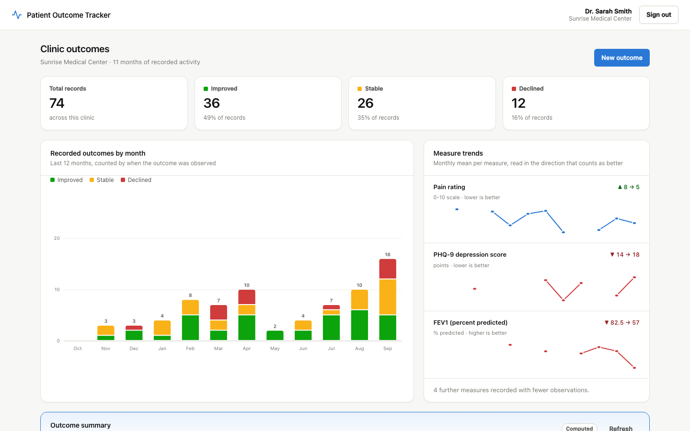
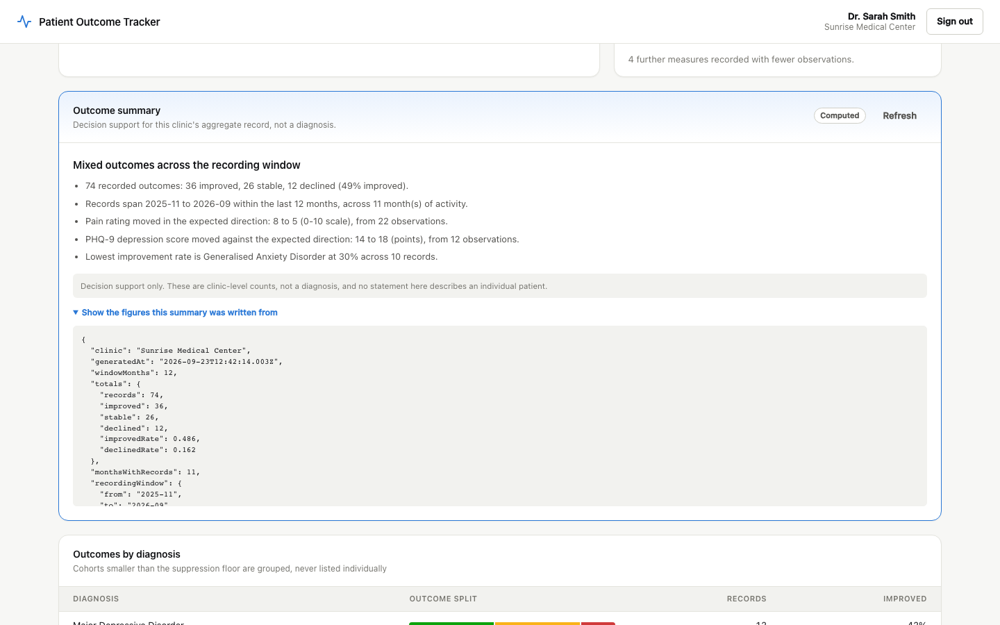
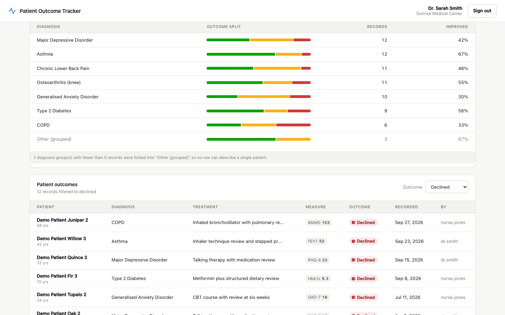
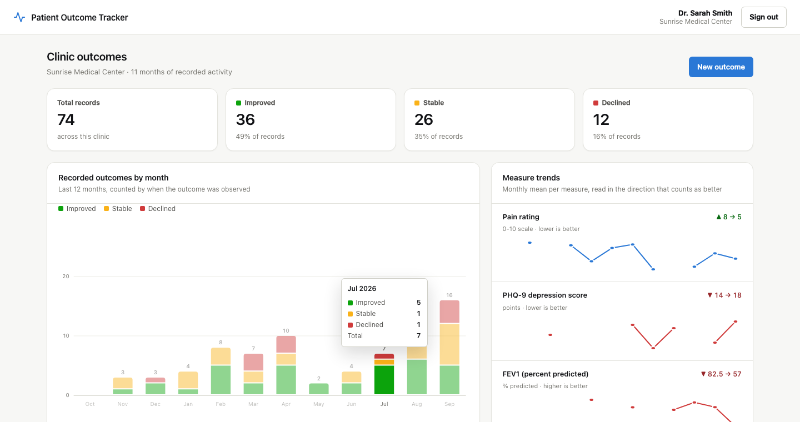
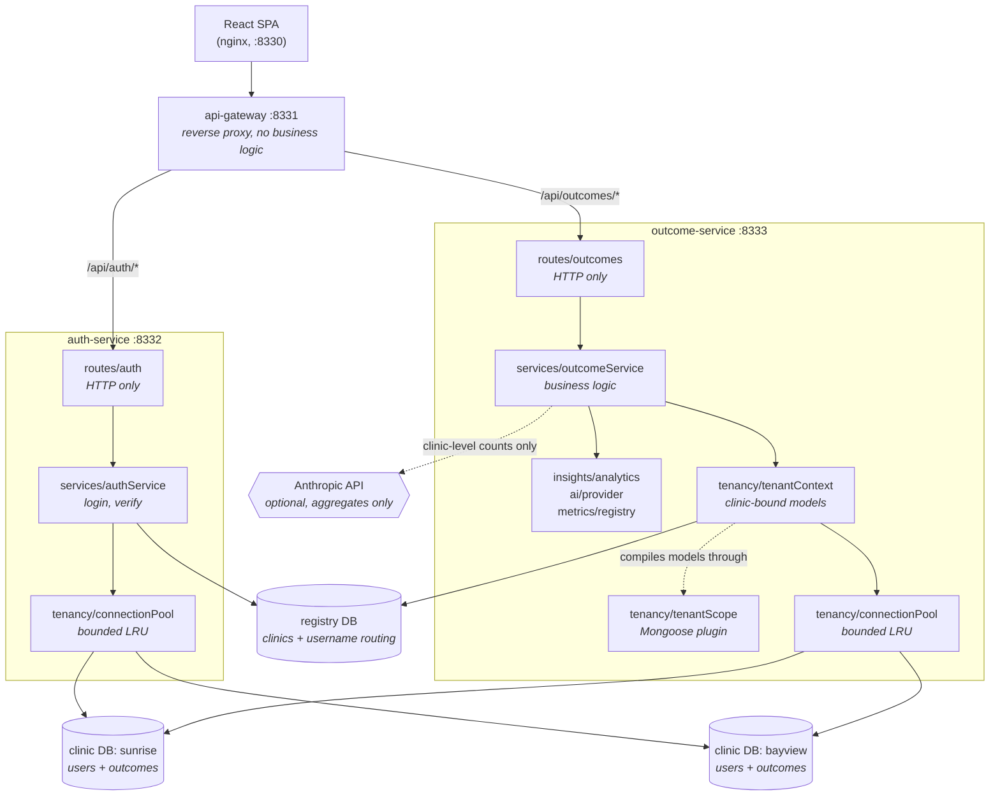

# Patient Outcome Tracker

A multi-tenant web application for clinics to record patient treatment outcomes and
read them back as trends, cohorts and a plain-language summary. Every clinic's
records live in their own MongoDB database, and the service layer is built so that a
query which forgets to name a clinic is rejected rather than answered.

All data in this repository — seed records, test fixtures, screenshots — is
synthetic. No real patient information is committed anywhere.

## Screenshots

A clinician's dashboard for a seeded clinic: outcome counts, the twelve-month trend,
and the measures the clinic tracks read in the direction that counts as improvement.



The outcome summary, with the aggregate figures it was written from expanded. The
badge says which provider wrote it — a language model, or the local computation that
runs when no API key is configured.



Outcomes grouped by diagnosis, with cohorts below the suppression floor folded into
one row, above the record table filtered to declined outcomes.



Hovering a month gives the exact split for that bucket.



## Architecture

Three Node services behind a gateway, a React SPA, and one MongoDB database per
clinic plus a shared registry.



The pattern is **layered / ports-and-adapters with a composition root**. Dependency
arrows point inward: routers depend on services, services depend on the tenancy,
metric and AI abstractions, and nothing in the inner layers imports Express or reads
`process.env`. Each service has a `src/container.js` that is the single place where
concrete implementations are chosen, which is how a test can assemble the same object
graph with a stubbed AI provider and never touch the network.

Data is split across two kinds of database:

- **Registry DB** (`patient_tracker_registry`) — the clinic list, each with the name
  of its database, plus a `username -> clinicId` routing table. It holds no passwords
  and no patient data.
- **One DB per clinic** (e.g. `patient_tracker_clinic_sunrise`) — that clinic's users
  (bcrypt hashes) and that clinic's outcome records.

## How a request is scoped

The interesting path is a read of patient records, because that is where a
multi-tenant system fails quietly. Scoping happens three times, and the third is
structural rather than remembered.

```mermaid
sequenceDiagram
    participant C as Clinician
    participant GW as api-gateway
    participant R as routes/outcomes
    participant T as tenantContext
    participant D as clinicDirectory
    participant P as connectionPool
    participant M as Outcome model<br/>(tenantScope plugin)
    participant DB as that clinic's DB

    C->>GW: GET /api/outcomes  (Bearer token)
    GW->>R: proxied
    R->>R: verify HS256, require userId + clinicId
    Note right of R: a token with no clinicId is 401,<br/>never an unscoped query
    R->>T: resolveTenantContext(clinicId)
    T->>D: requireActiveClinic(clinicId)
    D-->>T: clinic (cached, TTL) or 403 unknown/inactive
    T->>P: getClinicConnection(clinicId, dbName)
    P-->>T: pooled connection, Outcome model bound to this clinic
    T-->>R: { clinicId, models.Outcome }
    R->>M: find({ outcome: 'declined' })
    Note right of M: the filter names no clinic;<br/>the plugin injects one
    M->>DB: find({ outcome, clinicId })
    DB-->>M: rows
    M-->>C: 200 { outcomes, pagination }
```

If a future handler writes `Outcome.find({})` with no filter at all, the plugin still
injects the clinic. If it writes `Outcome.find({ clinicId: someOtherClinic })`, the
plugin throws instead of returning an empty list, because that is a bug and an empty
result would hide it.

## Quickstart

Docker is the short path — one command from nothing to a populated dashboard.

```bash
docker compose up --build
```

Then open <http://localhost:8330> and sign in as `dr.smith` / `password123`.

Compose starts MongoDB, runs both seed scripts as one-shot jobs, waits for them to
finish, then starts the three services and the SPA. Host ports are in the 8330-8339
range so the stack does not collide with anything already on 3000/5432/8000/8080:

| Host port | Service |
| --------- | ------- |
| 8330 | React SPA (nginx) |
| 8331 | api-gateway |
| 8332 | auth-service |
| 8333 | outcome-service |
| 8334 | MongoDB |

Tear it down with `docker compose down -v` (the `-v` also drops the seeded data).

### Demo credentials

Created by the seed. Development-only accounts.

| Clinic | Username | Password | Role |
| ------ | -------- | -------- | ---- |
| Sunrise Medical Center | `dr.smith` | `password123` | doctor |
| Sunrise Medical Center | `nurse.jones` | `password123` | nurse |
| Bayview Family Clinic | `dr.chen` | `password123` | doctor |
| Bayview Family Clinic | `admin.lee` | `password123` | admin |

Signing in as `dr.smith` and then as `dr.chen` shows two different record sets from
two different databases — the isolation is visible, not just asserted in a test.

## Configuration

Compose supplies a working default for every variable, so `docker compose up --build`
needs no `.env`. Copy `.env.example` to `.env` to override any of them.

### Shared by auth-service and outcome-service

| Variable | Required | Default | What it does |
| -------- | -------- | ------- | ------------ |
| `MONGODB_REGISTRY_URI` | **yes** | — | Full URI of the registry database |
| `MONGODB_BASE_URI` | **yes** | — | MongoDB server URI with no database name; per-clinic databases are opened beneath it |
| `JWT_SECRET` | **yes** | — | Signs and verifies tokens. Must be identical in both services |
| `CORS_ORIGIN` | no | localhost dev origins | Comma-separated allowed browser origins, or `*` |
| `TENANT_MAX_CONNECTIONS` | no | `50` | Most clinic connection pools held open at once; past this the least-recently-used clinic is evicted |
| `TENANT_POOL_SIZE` | no | `5` | Max sockets in each clinic's pool |
| `TENANT_MIN_POOL_SIZE` | no | `0` | Min sockets kept open per clinic |
| `TENANT_POOL_MAX_IDLE_MS` | no | `60000` | How long an idle socket is kept |
| `TENANT_EVICTION_DRAIN_MS` | no | `15000` | Grace period before an evicted connection is closed, so in-flight queries finish |
| `MONGO_SERVER_SELECTION_TIMEOUT_MS` | no | `5000` | How long a connection attempt waits before failing |

### auth-service only

| Variable | Required | Default | What it does |
| -------- | -------- | ------- | ------------ |
| `PORT` | no | `4001` | Port the service listens on |
| `JWT_EXPIRES_IN` | no | `24h` | Token lifetime |

### outcome-service only

| Variable | Required | Default | What it does |
| -------- | -------- | ------- | ------------ |
| `PORT` | no | `4002` | Port the service listens on |
| `PAGE_SIZE_DEFAULT` | no | `20` | Records per page when the request does not say |
| `PAGE_SIZE_MAX` | no | `100` | Hard ceiling on `?limit`, so one request cannot dump a clinic |
| `CLINIC_CACHE_TTL_MS` | no | `30000` | How long a clinic lookup is cached. `0` disables caching, making a deactivation take effect instantly at the cost of a registry query per request |
| `CLINIC_CACHE_MAX` | no | `1000` | Most clinic records held in that cache |
| `INSIGHT_MIN_GROUP_SIZE` | no | `5` | Smallest diagnosis cohort that may be reported on its own; smaller ones are folded into "Other (grouped)" |
| `INSIGHT_WINDOW_MONTHS` | no | `12` | Default trend window |
| `INSIGHT_MAX_GROUPS` | no | `8` | Most cohorts reported before the tail is grouped |
| `METRIC_DEFINITIONS_PATH` | no | — | JSON file of extra outcome measure definitions, merged over the built-ins |
| `ANTHROPIC_API_KEY` | no | — | Unset, summaries are computed locally and nothing leaves the host. Set, Claude writes them |
| `ANTHROPIC_MODEL` | no | `claude-opus-5` | Model used for summaries |
| `ANTHROPIC_MAX_TOKENS` | no | `4000` | Response ceiling for a summary |
| `ANTHROPIC_EFFORT` | no | `low` | Effort level; a summary of a dozen numbers does not need more |
| `ANTHROPIC_TIMEOUT_MS` | no | `30000` | Request timeout before falling back to the computed summary |

### api-gateway

| Variable | Required | Default | What it does |
| -------- | -------- | ------- | ------------ |
| `PORT` | no | `4000` | Port the gateway listens on |
| `AUTH_SERVICE_URL` | **yes** | — | Base URL of auth-service |
| `OUTCOME_SERVICE_URL` | **yes** | — | Base URL of outcome-service |
| `CORS_ORIGIN` | no | localhost dev origins | Comma-separated allowed browser origins |

### frontend (build time)

| Variable | Required | Default | What it does |
| -------- | -------- | ------- | ------------ |
| `VITE_API_BASE_URL` | no | `http://localhost:4000` | Gateway URL compiled into the bundle. Compose passes `http://localhost:8331` |

## Development

Running without Docker needs Node 18+ and a MongoDB instance.

```bash
npm run install:all      # root + all four packages

# one .env per backend service; see Configuration above
npm run seed             # clinics and users, then outcome records

npm run dev:gateway      # :4000
npm run dev:auth         # :4001
npm run dev:outcome      # :4002
cd frontend && npm run dev   # :5173
```

### Tests

```bash
npm test                 # both backend services
npm run test:auth
npm run test:outcome
```

Jest and supertest drive the real HTTP surface of each service against a real MongoDB
started in-process by `mongodb-memory-server` — no external database and no `.env`
required; the suites set their own configuration. The first run downloads a MongoDB
binary into `~/.cache/mongodb-binaries`.

**No test makes a network call to any model provider.** The AI provider takes its
client as an injected dependency, and the suites pass a stub. The stack also starts
and every endpoint works with `ANTHROPIC_API_KEY` unset.

### Linting

```bash
npm run lint             # the three Node services (flat config at the repo root)
npm run lint:frontend    # React + hooks rules (frontend/eslint.config.js)
```

The frontend has no test suite; `cd frontend && npm run build` type-checks it as far
as a JS project can be.

## Project structure

```
.
├── docker-compose.yml         whole stack, one command, seeded on first boot
├── eslint.config.js           flat config for the three Node services
├── .env.example               every override, with its default
├── seed.js                    runs both service seeds in order
│
├── api-gateway/
│   └── src/index.js           CORS, env validation, proxy routes, proxy error policy
│
├── auth-service/
│   └── src/
│       ├── app.js             Express wiring + the single error handler
│       ├── container.js       composition root
│       ├── config/            env -> typed, frozen configuration
│       ├── http/              HttpError types, asyncHandler
│       ├── routes/auth.js     HTTP surface only
│       ├── services/          login and token verification logic, no Express
│       ├── tenancy/           bounded LRU pool of per-clinic connections
│       ├── models/            registry models: Clinic, UserRegistry
│       ├── schemas/user.js    per-clinic user schema (hashing, comparePassword)
│       └── seed.js            clinics, routing entries, per-clinic users
│
├── outcome-service/
│   └── src/
│       ├── app.js             Express wiring + the single error handler
│       ├── container.js       composition root
│       ├── config/            env -> typed, frozen configuration
│       ├── http/              HttpError types, pagination, asyncHandler
│       ├── routes/outcomes.js HTTP surface only
│       ├── services/          all outcome business logic, expressed on a tenant
│       ├── tenancy/
│       │   ├── tenantScope.js   ** the Mongoose plugin that makes scoping structural **
│       │   ├── tenantContext.js clinic identity + models already bound to it
│       │   ├── clinicDirectory.js registry lookups with a bounded TTL cache
│       │   └── connectionPool.js  bounded LRU pool of per-clinic connections
│       ├── metrics/           the outcome measure registry (the extension seam)
│       ├── insights/          trend and cohort aggregation, small-cell suppression
│       ├── ai/                briefing builder, provider interface, computed fallback
│       ├── schemas/outcome.js base schema + the tenant-bound schema
│       └── seed.js            a year of synthetic records per clinic
│
├── frontend/src/
│   ├── api/client.js          fetch wrapper, attaches the bearer token
│   ├── context/               auth state, split so fast refresh works
│   ├── lib/outcomes.js        one source of truth for outcome colour and label
│   └── components/
│       ├── Dashboard.jsx      composition; owns loading and refresh
│       ├── charts/            dependency-free SVG charts with hover detail
│       ├── StatTiles, CohortTable, OutcomeTable, OutcomeForm, InsightPanel
│       └── Login.jsx
│
└── docs/screenshots/          captured from the running stack with Playwright
```

## API

Everything is reached through the gateway. Authenticated routes need
`Authorization: Bearer <token>`. Responses are `{ success, message?, data?, errors? }`.

| Method | Path | Auth | Description |
| ------ | ---- | ---- | ----------- |
| `POST` | `/api/auth/login` | none | `{ username, password }` -> `{ token, user }`. `401` bad credentials, `403` deactivated clinic |
| `GET` | `/api/auth/clinics` | none | Clinic names and ids for the login screen. Database names are never exposed |
| `GET` | `/api/auth/verify` | Bearer | Re-resolves the token's user and clinic |
| `GET` | `/api/outcomes` | Bearer | This clinic's records, newest observation first. `page`, `limit` (max 100), `outcome` |
| `POST` | `/api/outcomes` | Bearer | Create a record. `clinicId` and `createdBy` come from the token and cannot be set by the client |
| `GET` | `/api/outcomes/stats` | Bearer | Counts per outcome value, plus a total |
| `GET` | `/api/outcomes/trends` | Bearer | Monthly outcome counts over `months` (default 12, max 60), plus the monthly mean of each measure |
| `GET` | `/api/outcomes/cohorts` | Bearer | Outcome split by diagnosis, with small cohorts suppressed |
| `GET` | `/api/outcomes/insights` | Bearer | The summary, the briefing it was written from, and the decision-support disclaimer |
| `GET` | `/api/outcomes/metrics` | Bearer | The outcome measure registry: id, label, unit, range, direction |
| `GET` | `/health` | none | Liveness, on each service's own port |

A token for a clinic that is unknown or deactivated gets `403` on every outcome route,
with a message that does not confirm whether that clinic id exists.

## Design notes

### Multi-tenancy is structural, not remembered

One database per clinic gives real blast-radius containment: a query cannot
accidentally read another clinic's rows, because the rows are not in the same place.
That is the reason for the design, and it is a good one for clinical data.

It is not free, and the costs are load-bearing:

- **Connection pressure.** Every clinic is its own pool. At ten clinics that is
  nothing; at a thousand it is a thousand pools, each holding sockets against the
  server. Addressed below.
- **Migration fan-out.** A schema change runs N times, and can half-succeed. This is
  the main reason outcome measures are configuration rather than schema — see the
  extension seam.
- **Cross-tenant reporting is genuinely hard.** There is no `GROUP BY clinic_id`. A
  network-wide report has to fan out and merge in application code, or run off a
  separate warehouse. Nothing in this repository does that, and adding it would be a
  real project rather than an endpoint.

The 2026-09-22 audit fixed a vulnerability where a correctly-signed token with no
`clinicId` claim made the record query unscoped. That fix is still here, and so is its
test. But it fixed the paths that were broken, which leaves the guarantee resting on
every future handler remembering to scope itself.

So scoping moved down a layer, into `tenancy/tenantScope.js`, a Mongoose plugin bound
to one clinic at model-compile time:

- read, update and delete queries get `clinicId` injected into the filter, so a
  forgotten scope produces a correctly-scoped query rather than an unscoped one;
- a filter or update that names a *different* clinic **throws**, because that is a bug
  and returning an empty result would hide it;
- aggregations get a `$match` on `clinicId` prepended as stage zero;
- `estimatedDocumentCount` and `bulkWrite`, which bypass query middleware entirely,
  are disabled on clinic-bound models;
- the plugin requires a clinic id, and the only code that supplies one is the
  connection pool, which gets it from the authenticated request. **There is no way to
  compile an outcome model without saying which tenant it is for.**

The service layer never sees a connection — it is handed a `tenantContext`, an object
pairing a clinic identity with models already bound to it, so a caller cannot hold a
model without also holding the tenant it belongs to.

`tests/tenantScope.test.js` proves both halves: an empty filter still returns only one
clinic's rows, and a filter naming another clinic raises.

### Scalability

The bottleneck in a database-per-tenant system is not query speed, it is connections.

- **Bounded, least-recently-used connection cache.** The cache was unbounded, so at
  1,000 active clinics the service would hold 1,000 pools open and run out of file
  descriptors, or exhaust MongoDB's connection slots, long before it ran out of CPU.
  It is now capped (`TENANT_MAX_CONNECTIONS`, default 50) with LRU eviction, each pool
  capped at `TENANT_POOL_SIZE` (default 5) with an idle timeout. An evicted clinic is
  dropped from the map immediately but its connection is closed only after a drain
  delay, so queries already in flight finish rather than failing mid-request. A clinic
  that comes back simply reconnects. The concrete claim: at 1,000 clinics with 50
  cached connections, steady-state socket usage is bounded at 50x5, and the cost of
  the cap is a reconnect for clinics outside the working set.
- **A failed handshake is no longer cached forever.** The audit found the pool caching
  the *rejected* promise, so one blip made a clinic permanently unreachable until a
  restart. The pool now evicts on failure and retries on the next request. Completing
  that fix surfaced a second bug in the same code path: the cached promise had no
  rejection handler, so a failed handshake crashed the process with an unhandled
  rejection. Both are covered by `tests/connectionPool.test.js`.
- **The registry lookup is cached.** `requireActiveClinic` runs on every authenticated
  request; uncached it puts a registry round-trip in front of every read. It now has a
  bounded TTL cache that also caches the negative answer, so a forged clinic id is not
  a free way to hammer the registry. The cost is honest: deactivating a clinic takes
  effect within `CLINIC_CACHE_TTL_MS` (default 30s) rather than instantly, and setting
  it to `0` buys instant revocation back at one query per request.
- **Indexes match the queries.** `{clinicId, recordedAt}`, `{clinicId, outcome,
  recordedAt}` and `{clinicId, createdAt}`. The filtered listing sorts after an
  equality match on `outcome`, which is why it gets its own compound index instead of
  an in-memory sort. There is no single-field index on `clinicId`: every query is
  clinic-scoped, so the compound indexes already cover it as their prefix.
- **Pagination is clamped, not trusted.** `?limit=100000` returns 100 rows. Unparsable
  or negative values fall back to the default rather than producing a `NaN` skip.
  Listings use `.lean()`, because hydrating a Mongoose document per row is the
  dominant cost on a response that is serialised straight back out.
- **Aggregation happens in MongoDB.** Trends and cohorts are pipelines, not
  `find()`-then-loop-in-Node.

What is deliberately *not* here: no queue, no Redis, no Kubernetes. Nothing in this
workload is slow enough to justify them, and adding them would be decoration.

### Extensibility: the outcome measure registry

The seam a clinic actually asks for is "we want to start tracking a new measure."
Under one-database-per-clinic, doing that as a schema field means a migration fanned
out across every clinic database — the single most expensive change this architecture
can be asked to make.

So a record stores `measures` as an open map of `metricId -> number`, and
`src/metrics/registry.js` is the only thing that decides which ids are legal, what
range each accepts, and which direction counts as improvement. Adding PHQ-9, a
six-minute walk distance or a grip-strength score is an entry in that list, or in the
JSON file named by `METRIC_DEFINITIONS_PATH`. No Mongoose field, no migration, no
frontend change: the form's measure dropdown and the dashboard's measure panel are
both populated from `GET /api/outcomes/metrics`.

`direction` is part of the definition rather than an assumption, because for half of
these measures lower is better. Nothing in the codebase is allowed to assume "up is
good" — the dashboard's green and red arrows come from the registry.

### AI: outcome summarisation as decision support

`GET /api/outcomes/insights` returns a short summary of a clinic's aggregate record.
Three rules shape the design:

1. **The model never sees a patient record.** It is given a *briefing* — counts,
   monthly totals, cohort splits and measure means, all of which have already been
   through small-cell suppression. `ai/briefing.js` walks the object and throws if a
   patient field ever appears in it, so widening the briefing later fails loudly
   rather than quietly shipping PHI to a third-party API.
2. **It shows its inputs.** The response carries the exact briefing alongside the
   summary, and the dashboard renders it behind a disclosure. A decision-support
   answer whose inputs you cannot inspect is an oracle, not decision support.
3. **It is framed as decision support and never as diagnosis.** The system prompt
   forbids diagnosing, recommending or changing treatment, and forbids describing an
   individual patient. The response carries a disclaimer the UI always renders.

The provider interface has one method. Two implementations ship: `computed`, which
needs no key and no network, and `anthropic`, which uses Claude. **Every** failure of
the second — no key, timeout, rate limit, a policy refusal, a reply in the wrong shape
— falls back to the first, and the response says which one answered. The feature has
no "AI is down" state; with no key configured the dashboard simply shows a summary
with a `Computed` badge.

### Small-cell suppression

A cohort of one is an identifier. Any diagnosis group smaller than
`INSIGHT_MIN_GROUP_SIZE` (default 5) is folded into a single "Other (grouped)" row
before it leaves the service, and the response says how many groups were folded, so a
reader knows something is missing rather than wondering why a diagnosis they recorded
is absent.

### Handling PHI in errors and logs

Mongoose validation and cast errors embed the submitted document values, which here
are patient names, diagnoses and free-text notes. So each service has exactly one
error handler, and only errors that opt in (an `HttpError` subclass) reach the client
with their own message; everything else becomes a flat 500. Log lines record an
error's name and message, never the error object and never the request body. Measure
validation names the offending metric but never echoes its value.

### Charts

The dashboard's charts are hand-written SVG with no charting dependency — a stacked
bar for monthly outcome counts and a line per measure. They are separate charts on
purpose: putting record counts and a PHQ-9 mean on one plot with two y-axes would let
the reader invent a correlation by choosing the scales. Outcome states use reserved
status colours (green/amber/red) and are always accompanied by a written label, in the
legend, the pill and the tooltip, so colour never carries the meaning alone.

## Limitations

- **No cross-clinic reporting.** By design, and genuinely hard to add — see the
  per-tenant database costs above.
- **No rate limiting on login.** `POST /api/auth/login` is unthrottled. Put a limiter
  in front of the gateway before this runs anywhere real.
- **No refresh tokens or revocation list.** A token is valid until it expires.
  Deactivating a clinic is re-checked on every request and is the only revocation
  mechanism; deactivating a single *user* does not invalidate their existing token.
- **No audit log.** Reads and writes of patient records are not recorded. Real PHI
  handling needs one.
- **No role enforcement.** The token carries a role and the UI shows it, but every
  authenticated user of a clinic can read and write every record in it.
- **No record editing or deletion.** Outcomes are append-only through the API.
- **The registry is a single point of failure**, and it is not replicated here.
- **No frontend test suite.** The SPA is covered by linting and a production build
  only; its behaviour is verified by hand and by the screenshots above.
- **The two services duplicate their connection pool.** They are separate npm
  packages binding different models; sharing the ~60 lines would mean a fourth package
  to version and publish.
- **Nothing here is a certified medical device**, and the summarisation feature is not
  a clinical decision support system in the regulatory sense.
