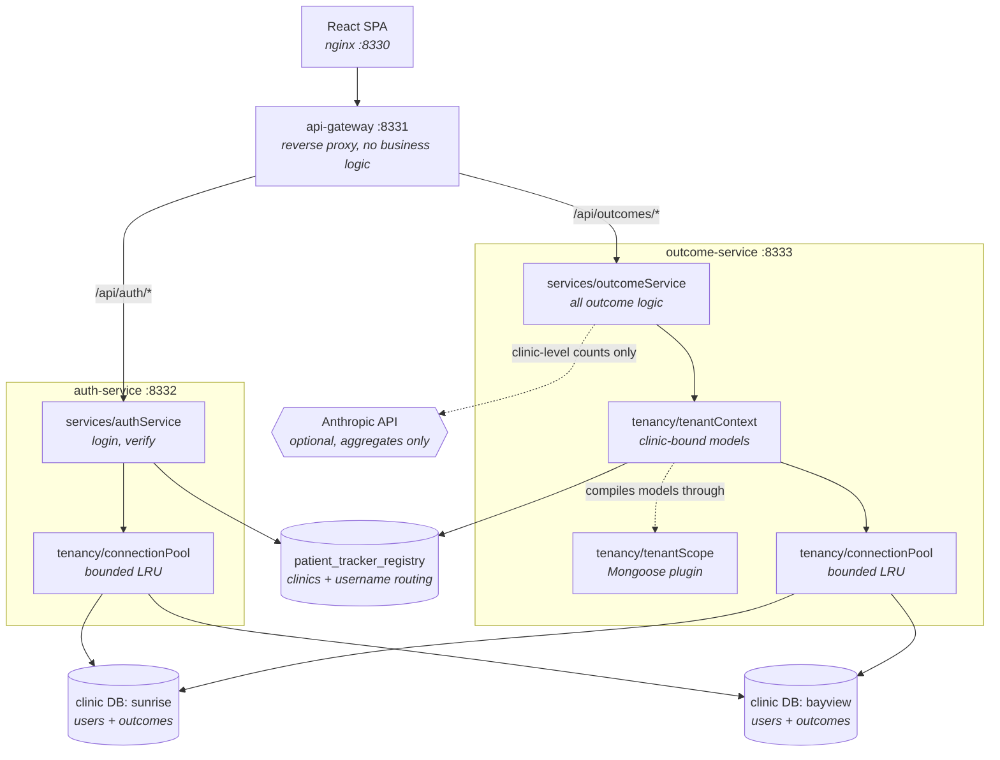
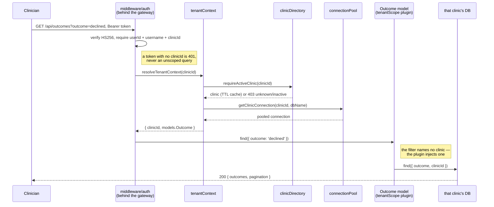
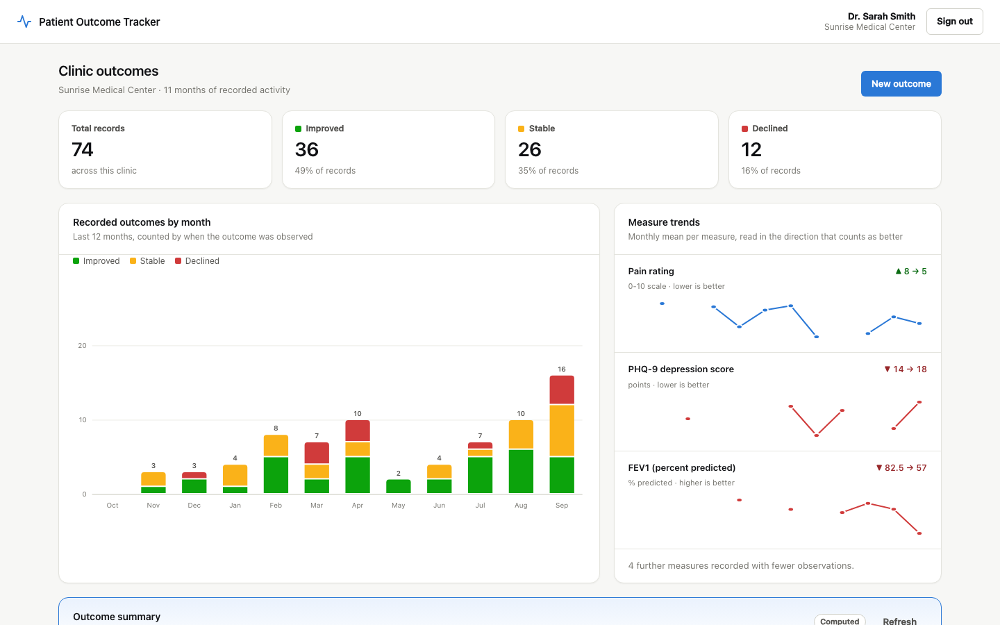
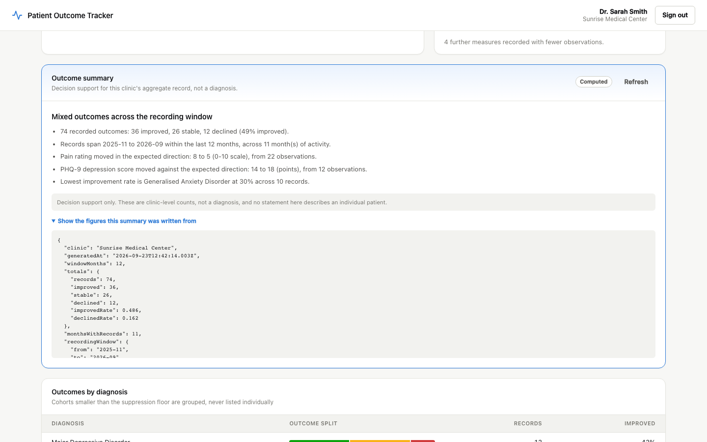
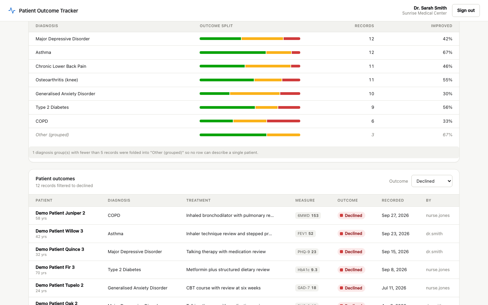
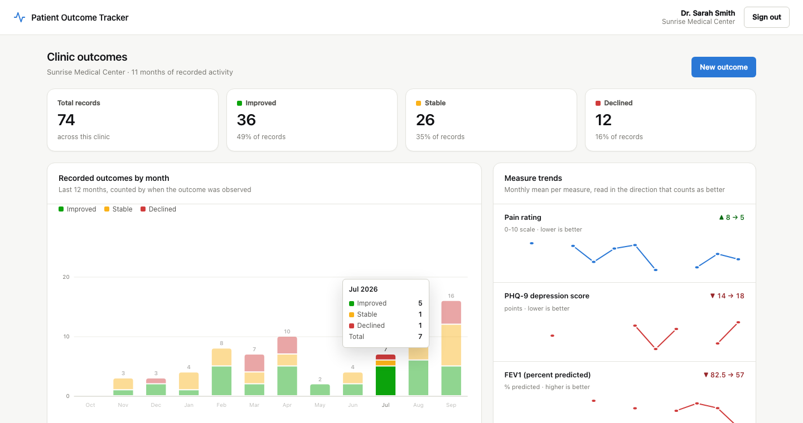

# Patient Outcome Tracker

Clinics record a patient's treatment outcome — improved, stable or declined — alongside
whatever numeric measures they track for that condition, and read it back as trends,
diagnosis cohorts and a plain-language summary. The tenancy is physical: **every clinic's
records live in their own MongoDB database**, and the service layer is built so that a
query which forgets to name a clinic is rejected rather than answered.

Everything here — seed data, test fixtures, the screenshots below — is synthetic; seeded
patients are literally named `Demo Patient <tree>`. No real patient data is committed.

## One database per clinic, and the bill for it

This is the decision the rest of the system is shaped around. What it buys is blast-radius
containment: a query cannot accidentally read another clinic's rows, because the rows are
not in the same place. What it costs is real and load-bearing:

- **Connection pressure.** Every clinic is its own pool. At ten clinics that is nothing;
  at a thousand it is a thousand pools holding sockets against the server. See
  [Keeping the connection count finite](#keeping-the-connection-count-finite).
- **Migration fan-out.** A schema change runs N times and can half-succeed — the main
  reason outcome measures are configuration rather than schema, see
  [Adding a measure without a migration](#adding-a-measure-without-a-migration).
- **Cross-tenant reporting is genuinely hard.** There is no `GROUP BY clinic_id`; a
  network-wide report has to fan out and merge in application code, or run off a separate
  warehouse. Nothing here does that, and adding it would be a project, not an endpoint.

Three Node services sit in front of those databases (ports as Compose publishes them):


```mermaid
flowchart TB
    Browser["React SPA<br/><i>nginx :8330</i>"]
    GW["api-gateway :8331<br/><i>reverse proxy, no business logic</i>"]
    subgraph auth["auth-service :8332"]
        AS["services/authService<br/><i>login, verify</i>"]
        APool["tenancy/connectionPool<br/><i>bounded LRU</i>"]
    end
    subgraph outcome["outcome-service :8333"]
        OS["services/outcomeService<br/><i>all outcome logic</i>"]
        TC["tenancy/tenantContext<br/><i>clinic-bound models</i>"]
        TS["tenancy/tenantScope<br/><i>Mongoose plugin</i>"]
        OPool["tenancy/connectionPool<br/><i>bounded LRU</i>"]
    end
    Registry[("patient_tracker_registry<br/><i>clinics + username routing</i>")]
    ClinicA[("clinic DB: sunrise<br/><i>users + outcomes</i>")]
    ClinicB[("clinic DB: bayview<br/><i>users + outcomes</i>")]
    Claude{{"Anthropic API<br/><i>optional, aggregates only</i>"}}
    Browser --> GW
    GW -->|/api/auth/*| AS
    GW -->|/api/outcomes/*| OS
    AS --> APool
    AS --> Registry
    OS --> TC
    TC --> Registry
    TC --> OPool
    TC -.->|compiles models through| TS
    OS -.->|"clinic-level counts only"| Claude
    APool --> ClinicA & ClinicB
    OPool --> ClinicA & ClinicB
```

The registry database holds the clinic list — each with the name of its database — plus a
`username -> clinicId` routing table, because a username alone does not say which database
holds the password hash; it stores no credentials and no patient data. Each clinic database
holds that clinic's users (bcrypt hashes) and its outcome records. Dependency arrows point
inward: routers depend on services, services depend on the tenancy, metric and AI
abstractions, and nothing in the inner layers imports Express or reads `process.env`. Each
service's `src/container.js` is its single composition root, which is how a test assembles
the same object graph with a stubbed AI provider.

## Why a query cannot forget its clinic

An earlier version of this service accepted a correctly-signed token carrying **no
`clinicId` claim**, leaving the record query that followed unscoped — one clinic could read
another's patient records. Fixing the token check closed that path but left the guarantee
resting on every future handler remembering to scope itself. So scoping moved down a layer,
into `outcome-service/src/tenancy/tenantScope.js`: a Mongoose plugin bound to one clinic at
model-compile time.

- Read, update and delete queries get `clinicId` injected into the filter, so a forgotten
  scope produces a correctly scoped query rather than an unscoped one; aggregations get a
  `$match` on `clinicId` prepended as stage zero.
- A filter, update or document naming a **different** clinic **throws**. An empty result
  would hide the bug; an exception does not.
- `estimatedDocumentCount` and `bulkWrite`, which bypass query middleware entirely, become
  throwing stubs on clinic-bound models.
- The plugin requires a clinic id, supplied only by the connection pool, which takes it from
  the authenticated request. **There is no way to compile an outcome model without saying
  which tenant it is for.**

The service layer never sees a connection: it is handed a `tenantContext`, a frozen object
pairing a clinic identity with models already bound to it, so a caller cannot hold a model
without the tenant it belongs to. One authenticated read, end to end:


```mermaid
sequenceDiagram
    participant C as Clinician
    participant A as middleware/auth<br/>(behind the gateway)
    participant T as tenantContext
    participant D as clinicDirectory
    participant P as connectionPool
    participant M as Outcome model<br/>(tenantScope plugin)
    participant DB as that clinic's DB

    C->>A: GET /api/outcomes?outcome=declined, Bearer token
    A->>A: verify HS256, require userId + username + clinicId
    Note right of A: a token with no clinicId is 401,<br/>never an unscoped query
    A->>T: resolveTenantContext(clinicId)
    T->>D: requireActiveClinic(clinicId)
    D-->>T: clinic (TTL cache) or 403 unknown/inactive
    T->>P: getClinicConnection(clinicId, dbName)
    P-->>T: pooled connection
    T-->>A: { clinicId, models.Outcome }
    A->>M: find({ outcome: 'declined' })
    Note right of M: the filter names no clinic —<br/>the plugin injects one
    M->>DB: find({ outcome, clinicId })
    DB-->>C: 200 { outcomes, pagination }
```

`tests/tenantScope.test.js` pins both halves — an empty filter still returns one clinic's
rows, a filter naming another clinic raises — and `tests/outcomes.access.test.js` covers the
same ground end to end, including the no-`clinicId`-claim token.

## What the dashboard shows

A clinician's dashboard: outcome counts, the twelve-month trend, and each measure read in
the direction that counts as improvement for it.



The outcome summary, with the aggregate figures it was written from expanded. The badge
says which provider wrote it — a model, or the local computation used when no key is set.



Outcomes grouped by diagnosis — cohorts below the suppression floor folded into one row —
above the record table filtered to declined outcomes.



Hovering a month gives the exact split for that bucket. All four shots are headless
Playwright at 1440x900 against the Docker stack. The charts are hand-written SVG — React and
React DOM are the frontend's only runtime dependencies — and record counts and measure means
are deliberately *separate* plots: on one pair of axes a reader could invent a correlation.



## Running it

Docker is the short path — one command from nothing to a populated dashboard:

```bash
docker compose up --build     # then open http://localhost:8330
```

Compose starts MongoDB, runs both seed scripts as ordered one-shot jobs and waits for them
to finish, then starts the three services and the nginx-served SPA; `docker compose down -v`
drops it and the seeded data. Verified from a clean slate — `down -v` then `up -d --build`
brought all five services healthy, and each clinic's own data came back over HTTP from
`/stats`, `/trends`, `/cohorts` and `/insights`.

Every seeded account uses the password `password123`: `dr.smith` and `nurse.jones` at Sunrise
Medical Center, `dr.chen` and `admin.lee` at Bayview Family Clinic. Sign in as `dr.smith` (74
records), then as `dr.chen` (61 records, from a different database) — the isolation is
visible, not merely asserted in a test.

The test suite needs Node 18+ and nothing else — no MongoDB, no `.env`:

```bash
npm run install:all      # root + the four packages
npm test                 # 192 tests across 13 suites
npm run lint             # three Node services; npm run lint:frontend for the SPA
```

Jest and supertest drive the real HTTP surface of each service against a real MongoDB
started in-process by `mongodb-memory-server` (the first run downloads a binary into
`~/.cache/mongodb-binaries`). **No test makes a network call to any model provider** — the AI
provider takes its client as an injected dependency and the suites pass a stub, and with
`ANTHROPIC_API_KEY` never set every endpoint under [API](#api) is still exercised.

Running the services without Docker needs a MongoDB instance and a `.env` per backend
service. Three variables are required with no defaults — `MONGODB_REGISTRY_URI`,
`MONGODB_BASE_URI` (a server URI with no database name; per-clinic databases open beneath
it) and `JWT_SECRET`, identical in both — while the gateway needs `AUTH_SERVICE_URL` and
`OUTCOME_SERVICE_URL`. The rest are optional; `.env.example` has the ones worth changing.

```bash
npm run seed             # clinics and users, then a year of synthetic records
npm run dev:gateway      # :4000
npm run dev:auth         # :4001
npm run dev:outcome      # :4002
npm run dev:frontend     # :5173 — set VITE_API_BASE_URL if the gateway moved
```

## API

Everything is reached through the gateway; authenticated routes need
`Authorization: Bearer <token>` and responses are `{ success, message?, data?, errors? }`.

| Method | Path | Auth | Description |
| ------ | ---- | ---- | ----------- |
| `POST` | `/api/auth/login` | none | `{ username, password }` -> `{ token, user }`. `401` bad credentials, `403` deactivated clinic |
| `GET` | `/api/auth/clinics` | none | Clinic names and ids for the login screen. Database names are never selected |
| `GET` | `/api/auth/verify` | Bearer | Re-resolves the token's user and clinic |
| `GET` | `/api/outcomes` | Bearer | This clinic's records, newest observation first. `page`, `limit` (max 100), `outcome` |
| `POST` | `/api/outcomes` | Bearer | Create a record. `clinicId` and `createdBy` come from the token and cannot be set by the client |
| `GET` | `/api/outcomes/stats` | Bearer | Counts per outcome value, plus a total |
| `GET` | `/api/outcomes/trends` | Bearer | Monthly outcome counts over `months` (default 12, max 60), plus the monthly mean of each measure |
| `GET` | `/api/outcomes/cohorts` | Bearer | Outcome split by diagnosis, with small cohorts suppressed |
| `GET` | `/api/outcomes/insights` | Bearer | The summary, the briefing it was written from, and the decision-support disclaimer |
| `GET` | `/api/outcomes/metrics` | Bearer | The outcome measure registry: id, label, unit, range, direction |
| `GET` | `/health` | none | Liveness, on each service's own port |

A token for an unknown or deactivated clinic gets `403` on every outcome route, with a message
that does not confirm whether that clinic id exists. Note the absent verbs — records are
append-only.

## Keeping the connection count finite

The bottleneck in a database-per-tenant system is not query speed, it is connections.

- **Bounded, least-recently-used connection cache.** The cache was unbounded: at 1,000
  active clinics the service would hold 1,000 pools open and exhaust file descriptors or
  MongoDB connection slots long before it ran out of CPU. It is now capped
  (`TENANT_MAX_CONNECTIONS`, default 50) with LRU eviction, each pool capped at
  `TENANT_POOL_SIZE` (default 5), so steady-state socket usage is bounded at 50 × 5 however
  many clinics exist. An evicted clinic leaves the map at once but closes only after a drain
  delay, so in-flight queries finish; a clinic outside the working set pays a reconnect.
- **A failed handshake is no longer cached forever.** The pool used to cache the *rejected*
  promise, so one blip made a clinic unreachable until a restart. Fixing that surfaced a
  second bug in the same path: the cached promise had no rejection handler, so a failed
  handshake crashed the process. `tests/connectionPool.test.js` covers both, per service.
- **The registry lookup is cached**, negative answers included, so a forged clinic id is not
  a free way to hammer the registry on every request. The cost is honest: deactivating a
  clinic takes effect within `CLINIC_CACHE_TTL_MS` (default 30s), and `0` buys instant
  revocation back at one query per request.
- **Indexes match the queries:** `{clinicId, recordedAt}`, `{clinicId, outcome, recordedAt}`
  and `{clinicId, createdAt}`. The filtered listing sorts after an equality match on
  `outcome`, hence its own compound index rather than an in-memory sort; there is no
  single-field `clinicId` index, because the compound ones cover it as their prefix.
- **Pagination is clamped, not trusted.** `?limit=100000` returns 100 rows; unparsable or
  negative values fall back to the default rather than a `NaN` skip. Listings use `.lean()`,
  trends and cohorts are aggregation pipelines rather than `find()`-then-loop, and
  SIGTERM/SIGINT close every pooled connection before exit.

Deliberately absent: no queue, no Redis, no Kubernetes.

## Adding a measure without a migration

The seam a clinic actually asks for is "we want to start tracking a new measure." As a schema
field that means a migration fanned out across every clinic database — the most expensive
change this architecture can be asked to make. So a record stores `measures` as an open map
of `metricId -> number`, and `outcome-service/src/metrics/registry.js` is the only thing
deciding which ids are legal, what range each accepts and which direction counts as
improvement. Seven ship built in (PHQ-9, GAD-7, pain rating, HbA1c, systolic BP, six-minute
walk distance, FEV1 % predicted); an eighth is an entry in that list, or in the JSON file
named by `METRIC_DEFINITIONS_PATH` — no Mongoose field, no migration, no frontend change,
because the entry form's dropdown and the dashboard's measure panel both come from
`GET /api/outcomes/metrics`. `direction` is part of each definition rather than an assumption
(for five of the seven, lower is better), and `isImprovement()` is the only thing allowed to
decide which way is good — the dashboard's arrows come from it.

## The summary, and what it is allowed to see

`GET /api/outcomes/insights` returns a short summary of a clinic's aggregate record, under
three rules.

1. **The model never sees a patient record.** It gets a *briefing* — counts, monthly totals,
   cohort splits and measure means, all already through small-cell suppression.
   `ai/briefing.js` walks that object and **throws** if a field like `patientName`, `notes`,
   `age` or `createdBy` appears anywhere in it, so widening the briefing later fails loudly
   rather than quietly shipping PHI to a third party.
2. **It shows its inputs.** The response carries the exact briefing alongside the summary
   and the dashboard renders it behind a disclosure — a decision-support answer whose inputs
   you cannot inspect is an oracle, not decision support.
3. **It is decision support, never diagnosis.** The system prompt forbids diagnosing,
   recommending or changing treatment, and forbids describing an individual patient. A
   disclaimer travels with every response and the UI always renders it.

The provider interface has one method and two implementations: `computed` (no key, no
network) and `anthropic` (Claude). **Every** failure of the second — no key, timeout, rate
limit, policy refusal, a reply in the wrong shape — falls back to the first, and the response
says which answered. There is no "AI is down" state: unkeyed, the dashboard shows a summary
with a `Computed` badge.

## PHI discipline

- **Small cells are suppressed.** A cohort of one is an identifier, so any diagnosis group
  smaller than `INSIGHT_MIN_GROUP_SIZE` (default 5) is folded into a single "Other (grouped)"
  row before it leaves the service — and the response says how many were folded.
- **Errors and logs do not carry record values.** Mongoose validation and cast errors embed
  the submitted document — here, patient names, diagnoses and notes. Each service has one
  error handler, and only errors that opt in (an `HttpError` subclass) reach the client with
  their own message; everything else becomes a flat 500. Log lines carry an error's name and
  message, never the error object or the body, and measure validation names the bad metric
  without echoing its value.
- **Colour never carries meaning alone** — the status colours are always paired with the
  written outcome label, in legend, pill and tooltip.

## What this does not do

- **No cross-clinic reporting** — by design, and genuinely hard to add.
- **No rate limiting on login** — `POST /api/auth/login` is unthrottled; put a limiter in
  front of the gateway first.
- **No refresh tokens or revocation list.** Clinic deactivation, re-checked on every request,
  is the only revocation there is; deactivating one *user* does not invalidate their token.
- **No audit log** of record reads and writes. Real PHI handling needs one.
- **No role enforcement.** The token carries a role and the UI shows it, but every
  authenticated user of a clinic can read and write every record in it.
- **The registry is a single point of failure**, and it is not replicated here.
- **No frontend test suite** — lint and a production build only.
- **Auth-side scoping is not structural** the way the outcome side is: a clinic's users are
  only reached through an already clinic-specific connection, so there is no filter to
  forget, but it is the weaker of the two guarantees.
- **The two services duplicate their connection pool** — separate npm packages binding
  different models, and sharing the ~60 lines would mean a fourth package to publish.
- **The live AI path is unverified** — no key is set and no test may spend money, so the
  provider has injected-client coverage only.
- **Nothing here is a certified medical device**, and the summarisation feature is not a
  clinical decision support system in the regulatory sense of that phrase.
